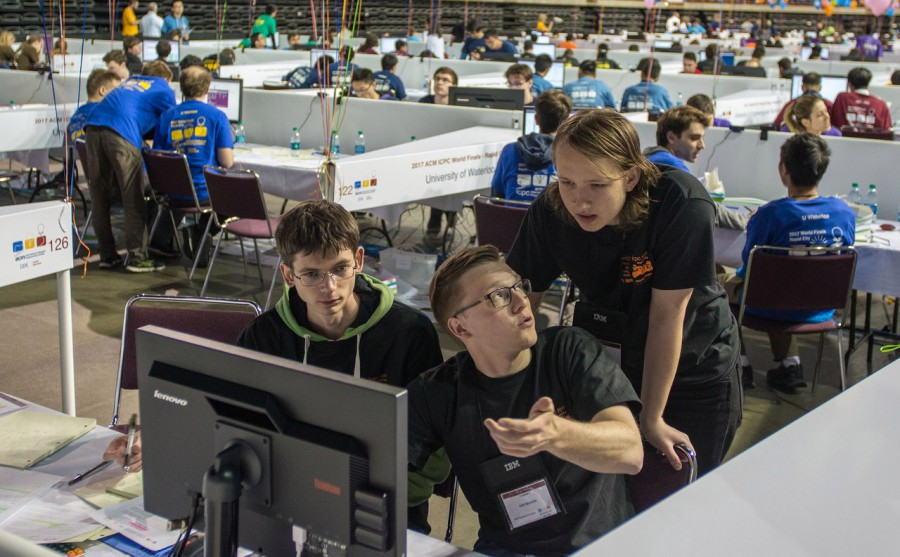
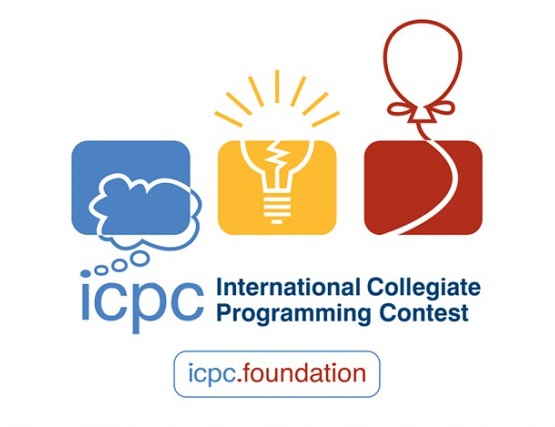
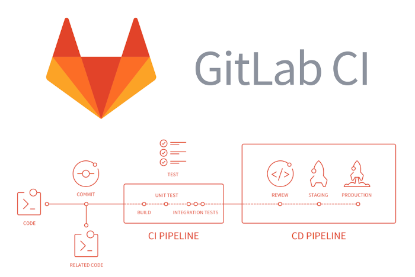
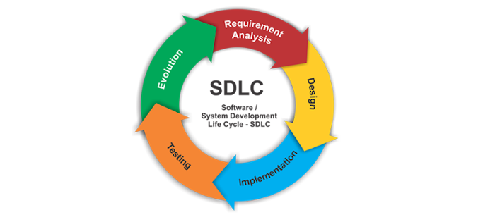
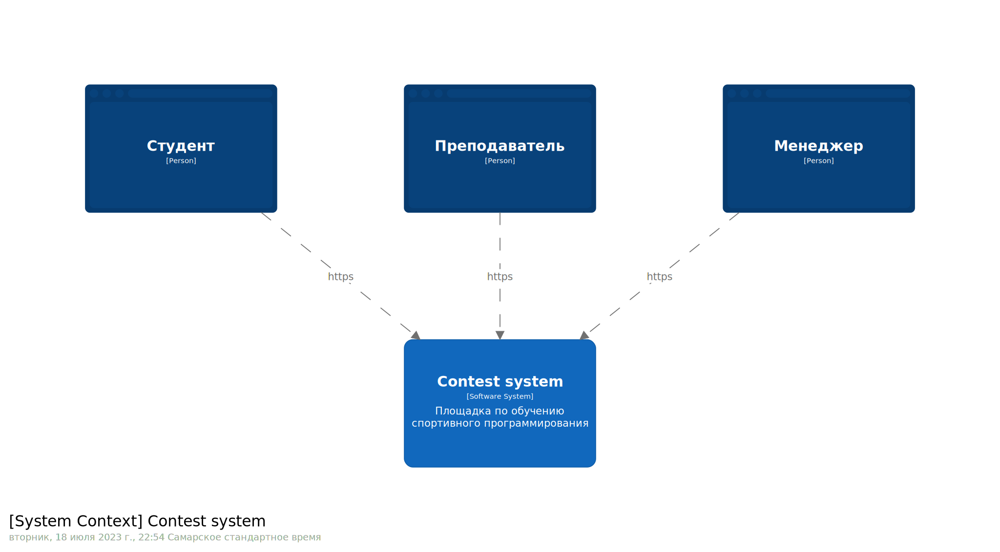
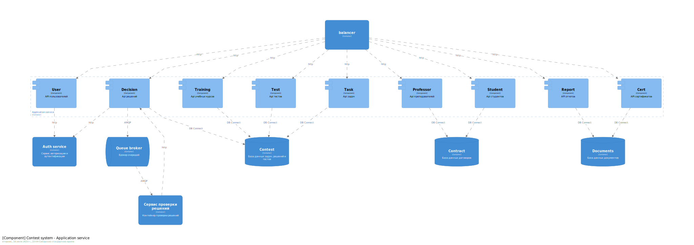
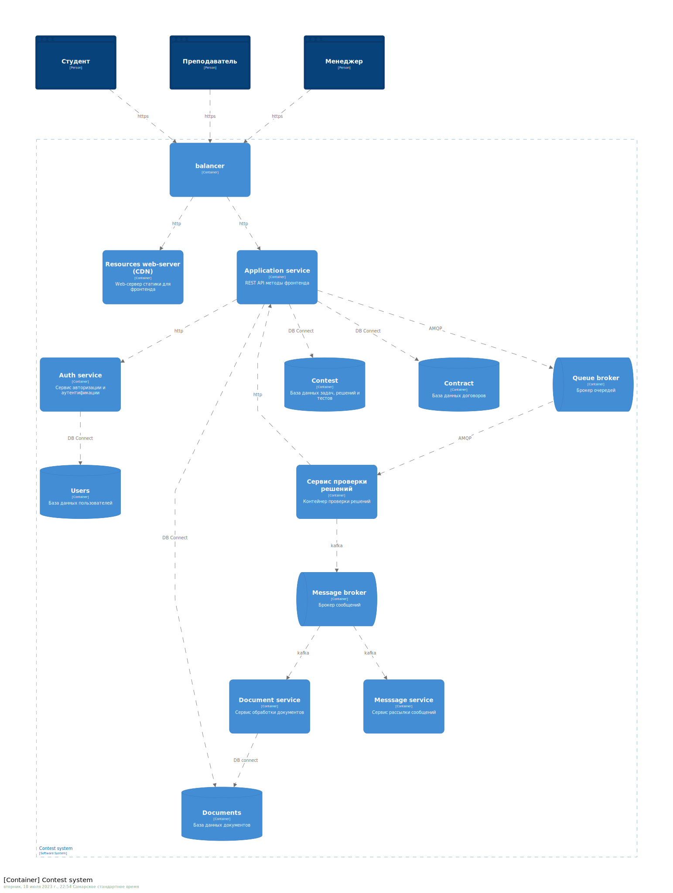

Площадка для обучения спортивному программированию с возможностью проведения на ней соревнований
==================

Проект выполнен в рамках курса 
["Software Architect"](https://otus.ru/lessons/software-architect/)
пройденного в компании OTUS в 2023 г. 

Данный документ является краткой пояснительной запиской о ходе его выполнения.

# 1. О себе

**Инюцин Андрей Александрович**

Бэкенд разработчик

В отрасли разработки ПО с 2005 года.

На данный момент работаю в компании ["Элоконт"](https://elocont.ru/).

Занимаюсь бэкендом проекта ["Миллион призов"](https://ag-vmeste.ru) правительства Москвы. 

Контакты: [inutcin@yandex.ru](mailto:inutcin@yandex.ru)

# 2. О чем будет рассказано

- [предметная область в рамках которой выполняется проект](#slide3);
- [проблемы и задачи, стоящие перед заказчиком](#slide4);
- [заинтересованные лица, пользовательские сценарии и атрибуты качества](#slide5);
- [варианты решения проблем и задач заказчика с разбором их преимуществ и недостатков](#slide6);
- [варианты функциональной декомпозиции системы и их оценка](#slide7);
- [взаимодействие пользователей и компонентов системы](#slide8);
- [развёртывание системы и выбор конкретных технологий](#slide9);
- [выводы и планы развития системы](#slide10);

#  
# 3. Предметная область в рамках которой выполняется проект.
(по мотивам архитектурного решения [ADR-0001](./docs/dicisions/ADR-0001/README.md#ch1))

## Спортивное программирование 

Вид киберспорта. За несколько часов участники 
должны написать программы для решения математических и алгоритмических задач, 
затем их результаты оценивают судьи. 

## Online judge система

Система автоматической проверки решений задач в спортивном программировании.
1. Участники соревнований отправляют код, решающий задачу через специальную 
форму. Ввод и вывод данных стандартизирован и происходит, как правило, через
stdin/stdout.
2. Система компилирует код и запускает на подготовленных тестах.
3. По результатам проверки на тестах составляются рейтинги участников по 
принятым равилам. 

Наиболее известная и активная online judge система - [codeforges](https://codeforces.com/).

[Другие online judge системы](https://sp.urfu.ru/links/?print)

## Наиболее значимые соревнования 

[ACM/ICPC](https://icpc.global/) - Международная студенческая олимпиада по 
программированию (в английском принято сокращение ICPC, до 2017 — ACM ICPC), 
называемая также Студенческим командным чемпионатом мира по программированию 
ICPC — крупнейшая студенческая командная олимпиада по программированию.

[Всероссийская олимпиада школьников](https://olimpiada.ru/activity/4337) - 
ежегодное соревнование, проводимое среди школьников. Хорошие результаты на 
заключительном этапе Всероссийской олимпиады школьников дают льготы при 
поступлении: от дополнительных баллов за ЕГЭ или портфолио до зачисления без 
экзаменов в профильные вузы.

Преимущества, получаемые успешными участниками соревнований по спортивному 
программированию при поступлении в учебные заведения порождают спрос на 
подготовку к подобным соревнованиям.

#  
# 4. Проблемы и задачи, стоящие перед заказчиком.
(по мотивам архитектурного решения [ADR-0001](./docs/dicisions/ADR-0001/README.md#ch2))

Заказчик - образовательнаяя организация, проводящая подготовку к соревнованиям 
по спортивному программированию. Для организации работы, учета и коммуникаций 
использует
- электронные таблицы в облачной среде googledoc
- электронную почту и системы мгновенных сообщений (telegram, viber и пр.)
- собственные инструменты и скрипты преподавателей, используемые ими на своих
рабочих станциях в инициативном порядке.

Такой набор инструментов создаёт следующие основные трудности:
- разграничение доступов к таблицам результатов и успеваемости затруднено и 
нетривиально;
- на коммуникации с обучающимися по рутинным учебным вопросам занимает много 
времени;
- ручная или полуавтоматическая проверка решений проходит слишком долго;
- персональные данные обцчающихся хранятся на серверах за пределами РФ, что 
противоречит ФЗ 152

#  
# 5. Заинтересованные лица, пользовательские сценарии и атрибуты качества.
(по мотивам архитектурного решения [ADR-0001](./docs/dicisions/ADR-0001/README.md#ch3))

## Менеджер

- организует размещение новых курсов
- организует приём на студентов на курс
- организует работу с преподавателями
- контролирует вопросы успеваемости и посещаемости
- организует работу с документами

## Преподаватель

- разрабатывает учебные задачи и тесты для их проверки в рамках курса
- производит проверку выполнения заданий
- консультирует студентов

## Студент

- решает учебные задачи и отправляет на проверку 
- исправляет ошибки и снова отправляет

## Атрибуты качества системы

- простой и быстрый процесс регистрации на курсах;
- быстрая проверка правильности решения;
- высокая доступность условий задач и непрерывный приём решений;
- наджное и безопасное хранение персональных данных, предоставленных решений и 
результатов проверки;

#  
# 6. Варианты решения проблем и задач заказчика с разбором их преимуществ и недостатков.
(по мотивам архитектурного решения [ADR-0001](./docs/dicisions/ADR-0001/README.md#ch10))

Было предложено 3 основных варианта решения проблем и задач заказчика

## Решение 1. Организационное.

Состоит в том, чтобы не менять текущий набор инструментов, а просто 
донастроить их и дописать фильтры/макросы для используемых программ/сервисов. 
И утвердить шаблоны/скрипты общения и обмена информацией.

## Решение 2. Средствами инстументов CI/СD

Решения студенты предоставляют в виде кода программ, который должен 
автоматически тестироваться и быть доступен преподавателю для ревью и 
комментирования. Звучит как обычная работа для системы контроля версий и 
настроенной поверх неё системы сборки и разворачикания кода: gitlab, jenkins и 
пр. Надо только развернуть и настроить конфигурацию и скрипты сборки-деплоя.

## Решение 3. Разработка собственной информационной системы с элементами online judge системы.

Разработка собственной информационной системы с элементами online judge. 
Наиболее гибкий но и наиболее продолжительный по времени и затратам вариант.
Уменьшить time to market тут бы позволила разработка минимальной версии продукта
(MPV)

## Решение 4*. Доработка готовой online judge системы

Очевидное, но не участвующее в сравнении. Оно бы составило серьёзную конкуренцию 
победителю и может быть даже победило само. Но поскольку одна из целей этого 
проекта продимонстрировать самые разные паттерны производительности, 
отказоустойчивости и пр. мы просто отметим, что такой вариант есть и 
рассматривать готовые решения нужно всегда.

## Итоги сравнения решений

Для дальнейшей работы выбрано решение 3: "Разработка собственной информационной 
системы с элементами online judge системы." 

В [ADR-0001](./docs/dicisions/ADR-0001/README.md#ch11)
есть таблицы сравнения по покрытию пользовательских сценариев, удовлетворению 
атрибутам качества, критическим сценариям. Рассотрены риски всех вариантов. 

#  
# 7. Варианты функциональной декомпозиции системы и их оценка.
(по мотивам архитектурного решения [ADR-0002](./docs/dicisions/ADR-0002/README.md))

Качество разбиения будем оценивать 
[в рамках сценариев изменений](./docs/dicisions/ADR-0002/README.md#change_scenario)

Рассматривались следующие варианты декомпозиции системы на компоненты.

## По взаимодействию с пользователями

Каждый компонент отвечает за совокупность действий, производимых одним из 
заинтересованных лиц:
- менеджер;
- преподаватель;
- студент;
- и пр.

Плюсы:
- простота тестирования и отладки
- интуитивно понятное разбиение на зоны ответственности

Минусы:
- сильная связность между компонентами
- трудоёмкость внесения изменений и дальнейшего развития

## По сущностям системы 

Каждый компонент отвечает за работу с сущностью системы:
- пользователь;
- курс;
- задача;
- решение задачи;
- тест для задачи;
- отчет;
- и пр

Плюсы: 
- легче развивать и модифицировать
- легче масштабировать наиболее проблемные компоненты

Минусы:
- сложнее отлаживать из за большого количества протоколов взаимодействия 
компонентов
- сложнее разворачивать на целевом "железе"

## Конечный выбор

В результате [сравнения](./docs/dicisions/ADR-0002/README.md#choos) для 
дальнейшей реализации выбрано разбиение на компоненты по сущностям системы

#  
# 8. Взаимодействие пользователей и компонентов системы.
(по мотивам архитектурного решения [ADR-0003](./docs/dicisions/ADR-0003/README.md))

Компоненты сгруппированы в сервисы, которые разботают в рамках микросервисной 
архитектуры. 

По адресату взаимодействия сервисы можно поделить на:

- **внешние** - сервисы, взаимодействующие с внешними системами:
    + сервис отправки сообщений;
    + сервис frontend-API.
- **внутренние** - сервисы, готовящие данные для внешних или других внутренних
сервисов:
    + сервис авторизации и аутентификации;
    + сервис обработки решений задач;
    + сервис подготовки документов и отчетов.

По протоколу взаимодействия:
- **rest-api**
    + сервис отправки сообщений;
    + сервис авторизации и аутентификации;
- **очередь**
    + сервис обработки решений задач;
- **брокер сообщений**
    + сервис подготовки документов и отчетов.
- **база данных**
    + все кроме сервиса обработки решений задач и сервиса отправки сообщений

По характеру запросов/ответов:
- **синхронные**
    + сервис frontend-API.
    + сервис авторизации и аутентификации;
- **асинхронные**
    + сервис обработки решений задач;
    + сервис подготовки документов и отчетов.
    + сервис отправки сообщений;
- **периодические**
    + пока нет, но скорее всего понадобятся для какий-то периодических действий

Так же можно ознакомиться со следующими документами:

- [Диаграммы последовательностей для сценариев](./docs/dicisions/ADR-0003/README.md#sequence)
- [Оценка атрибутов качества](./docs/dicisions/ADR-0003/README.md#assesment)

#  
# 9. Развёртывание системы и выбор конкретных технологий.
(по мотивам архитектурного решения [ADR-0004](./docs/dicisions/ADR-0004/README.md))

Система построена на основе микросервисной архитектуры и е контейнеры могут 
быть развёрнуты на любой из систем аркестрации контейнеров.

Все сервисы-контейнеры являются stateless:
- Balancer
- Resources web-server (CDN)
- Application service
- Auth service
- Processing service
- Document service
- Message service

Все сервисы-контейнеры могут быть запущены в любом количестве, которое требует 
ситуация и технические возможности. 

Все контейнеры, хранящие данные являются statefull:
- Contest (база данных с задачами, решениями и тестами)
- Contract (база данных с договорами и перс.данными пользователей)
- Users (база данных с пользователями и их сессиям)
- Documents (база данных документов - отчеты и сертификаты)
- Queue broker
- Message broker

Все контейнеры с данными должны запускать без использования аркестраторов
контейнеров. 

## Выбор технологий

Выбор конкретных технологий не в последнюю очередь зависит от кадровой ситуации 
в компании и ситуации на рынке труда и может варьироваться без фатального 
влияния на атрибуты качества системы и критические характеристики

- система оркестрации контейнеров: k8s, (docker-swarm?? docker-compose??)
- web-сервер и балансировщик трафика: nginx
- базы банных: postgresql (oracle? mysql?? clickhouse???)
- брокеры очередей: RaabbitMQ (redis??)
- брокеры сообщений: kafka (AWS?)
- языки программирования: java (php? go? python? все сразу в зависимости от функций сервиса?)

#  
# 10. Выводы и планы развития системы.

Мы разработали архитектуру площадки для обучения спортивному программированию 
до уровня конкретных контейнеров и их функций. 
- провели анализ предметной области
- сформировали список решаемых проблем и задач
- описали требования к системе и атрибуты её качества
- выбрали архитектурное решение и произвели его декомпозицию
- разработали схему и протоколы взаимодействия между компонентами
- описали схему развёртывания и произвели выбор конкретных технологий

На уровень проектирования кода мы не опускались, так решения принятые на нём при
следовании принятым архитектурным решениям, кардинально на атрибуты качества не 
влияют, если находятся в рамках оговорённых:
- протокола взаимодействия
- ограничениям, предъявляемым каждому сервису по времени отклика и доступности
- ограничениям по потребляемым ресурсам на один экземпляр сервиса

В будущем в систему за счет дорабоки существующих сервисов или создания новых
может быть добавлен следующий функционал
- авторизация через сторонние сервисы (например ЕСИА);
- Отправка решений через телеграм-ботов;
- Расширение номенклатуры используемых при решении задач языков программирования;
- электронная подпись документов; 
- оплата через различные платёжные шлюзы;
- и пр.

