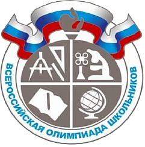

Площадка для обучения спортивному программированию с возможностью проведения на ней соревнований
==================

Проект выполнен в рамках курса 
["Software Architect"](https://otus.ru/lessons/software-architect/)
пройденного в компании OTUS в 2023 г. 

Данный документ является краткой пояснительной запиской о ходе его выполнения.

# 1. О себе

**Инюцин Андрей Александрович**

Бэкенд разработчик

В отрасли разработки ПО с 2005 года.

На данный момент работаю в компании ["Элоконт"](https://elocont.ru/).

Занимаюсь бэкендом проекта ["Миллион призов"](https://ag-vmeste.ru) правительства Москвы. 

Контакты: [inutcin@yandex.ru](mailto:inutcin@yandex.ru)

# 2. О чем будет рассказано

- [предметная область в рамках которой выполняется проект](#slide3);
- [проблемы и задачи, стоящие перед заказчиком](#slide4);
- [заинтересованные лица, пользовательские сценарии и атрибуты качества](#slide5);
- [варианты решения проблем и задач заказчика с разбором их преимуществ и недостатков](#slide6);
- [варианты функциональной декомпозиции системы и их оценка](#slide7);
- [взаимодействие пользователей и компонентов системы](#slide8);
- [развёртывание системы и выбор конкретных технологий](#slide9);
- [выводы и планы развития системы](#slide10);

#  
# 3. Предметная область в рамках которой выполняется проект.
(по мотивам архитектурного решения [ADR-0001](./docs/dicisions/ADR-0001/README.md#ch1))

## Спортивное программирование 

Вид киберспорта. За несколько часов участники 
должны написать программы для решения математических и алгоритмических задач, 
затем их результаты оценивают судьи. 

## Online judge система

Система автоматической проверки решений задач в спортивном программировании.
1. Участники соревнований отправляют код, решающий задачу через специальную 
форму. Ввод и вывод данных стандартизирован и происходит, как правило, через
stdin/stdout.
2. Система компилирует код и запускает на подготовленных тестах.
3. По результатам проверки на тестах составляются рейтинги участников по 
принятым равилам. 

Наиболее известная и активная online judge система - [codeforges](https://codeforces.com/).

[Другие online judge системы](https://sp.urfu.ru/links/?print)

## Наиболее значимые соревнования 

[ACM/ICPC](https://icpc.global/) - Международная студенческая олимпиада по 
программированию (в английском принято сокращение ICPC, до 2017 — ACM ICPC), 
называемая также Студенческим командным чемпионатом мира по программированию 
ICPC — крупнейшая студенческая командная олимпиада по программированию.

[Всероссийская олимпиада школьников](https://olimpiada.ru/activity/4337) - 
ежегодное соревнование, проводимое среди школьников. Хорошие результаты на 
заключительном этапе Всероссийской олимпиады школьников дают льготы при 
поступлении: от дополнительных баллов за ЕГЭ или портфолио до зачисления без 
экзаменов в профильные вузы.

Преимущества, получаемые успешными участниками соревнований по спортивному 
программированию при поступлении в учебные заведения порождают спрос на 
подготовку к подобным соревнованиям.

#  
# 4. Проблемы и задачи, стоящие перед заказчиком.
(по мотивам архитектурного решения [ADR-0001](./docs/dicisions/ADR-0001/README.md#ch2))

Заказчик - образовательнаяя организация, проводящая подготовку к соревнованиям 
по спортивному программированию. Для организации работы, учета и коммуникаций 
использует
- электронные таблицы в облачной среде googledoc
- электронную почту и системы мгновенных сообщений (telegram, viber и пр.)
- собственные инструменты и скрипты преподавателей, используемые ими на своих
рабочих станциях в инициативном порядке.

Такой набор инструментов создаёт следующие основные трудности:
- разграничение доступов к таблицам результатов и успеваемости затруднено и 
нетривиально;
- на коммуникации с обучающимися по рутинным учебным вопросам занимает много 
времени;
- ручная или полуавтоматическая проверка решений проходит слишком долго;
- персональные данные обцчающихся хранятся на серверах за пределами РФ, что 
противоречит ФЗ 152

#  
# 5. Заинтересованные лица, пользовательские сценарии и атрибуты качества.
(по мотивам архитектурного решения [ADR-0001](./docs/dicisions/ADR-0001/README.md#ch3))

## Менеджер

- организует размещение новых курсов
- организует приём на студентов на курс
- организует работу с преподавателями
- контролирует вопросы успеваемости и посещаемости
- организует работу с документами

## Преподаватель

- разрабатывает учебные задачи и тесты для их проверки
- производит проверку выполнения заданий
- консультирует студентов

## Студент

- решает учебные задачи и отправляет на проверку 

#  
# 6. Варианты решения проблем и задач заказчика с разбором их преимуществ и недостатков.

#  
# 7. Варианты функциональной декомпозиции системы и их оценка.

#  
# 8. Взаимодействие пользователей и компонентов системы.

#  
# 9. Развёртывание системы и выбор конкретных технологий.

#  
# 10. Выводы и пралы развития системы.

