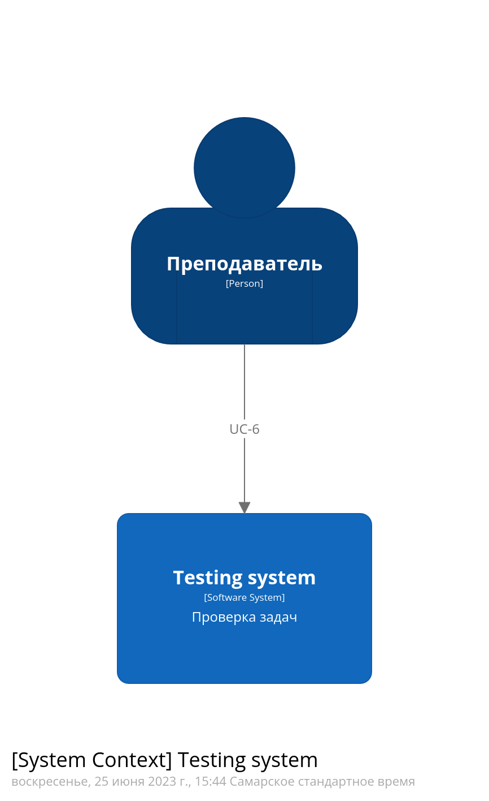
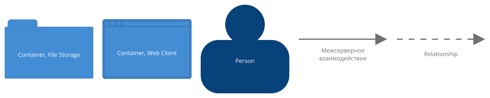

Создание площадки для обучения спортивному программированию
=========
|          |                                                                   |
|----------|-------------------------------------------------------------------|
|Status:   | proposed
|Deciders: | dev, devops                                                       |
|Date:     | 29.05.2023                                                        |


# Кейс

Образовательная организация Alef предоставляет услуги по обучению спортивному
программированию на языках программирования **C++** и **Python 3** и регулярно 
проводит соревнования по спортивному программированию среди своих учащихся.

Учащимся выдаётся набор задач по программированию через google-doc с выдачей
индивидуально каждому прав на просмотр по email
Решением для задач является код на выбранном языке программирования. 
Задачи дифференцируются по сложности, а оценка решения производится по критериям
- количество и сложность пройденных тестов
- количество попыток решения
- время сдачи решения.

Задача содержит: 
- описание ограничений по памяти и времени выполнения
- условие задачи
- описание входных данных
- описание выходных данных
- пример входных данных
- пример выходных данных
- примечание к примеру входных и выходных данных

Учащиеся в оговорённые сроки присылают решения на рабочий email преподавателя, 
а преподаватель должен проверить работу и выслать обратным письмом результат: 
успешное выполнение или сообщение об ошибки с указанием на каких данных код 
учащегося выдал неверные результаты.

Результаты проверки публикуются в другой google-таблице, а сводная статистика по
успеваемости в третьей.

По результатам прождения курса обучения администрация организации принимает
решение об успешности прохождения обучения и награждении наиболее отличившихся.

Проверять решение задач вручную является довольно затратным процессом. Так же
много времени и сил у педагогов отнимает публикация результатов решения 
для учащихся и административных сотрудников организации. При том что это разные 
по составу отчёты: 
- Для административных сотрудников необходима информация об успеваемости
учащихся
- Для учащихся необходима информации о проверке конкрретно их решения и
примеры(тесты), на которых их решение.


Пример задачи (пример позаимствован тут https://codeforces.com/contest/1833/problem/A)

Условие задачи

> Влад решил записать мелодию на своей гитаре. Представим мелодию как 
> последовательность нот, которым соответствуют символы 'a', 'b', 'c', 'd', 'e', 
> 'f' и 'g'.
> 
> Однако, он не очень опытен в игре на гитаре и может записать ровно две ноты за 
> раз. Влад хочет получить мелодию s и для этого он может сводить записанные 
> мелодии вместе. При этом, последний звук в первой мелодии должен совпадать с 
> первым звуком второй мелодии.
> 
> Например, если Влад записал мелодии «ab» и «ba», он может свести их вместе и 
> получить мелодию «aba», а потом свести результат с «ab» и получить «abab».
> 
> Помогите Владу определить, какое минимальное количество мелодий из двух нот ему 
> нужно записать, чтобы получить мелодию s.

Описание входных данных

> В первой строке входных данных содержится целое число **t** (1 < t < 10^4) - 
> количество наборов входных данных в тесте.
> 
> Далее следуют описания наборов.
> 
> Первая строка набора содержит целое число n (2≤n≤50) — длина мелодии s.
> 
> Вторая строка набора содержит строку s из n символов, каждый из которых 
> 'a', 'b', 'c', 'd', 'e', 'f' или 'g'.

Описание выходных данных

> Выведите **t** целых чисел, каждое из которых является ответом на 
> соответствующий набор входных данных. В качестве ответа выведите 
> **минимальное**
> количество мелодий из двух нот, которое нужно записать Владу.

Пример входных данных

```
5
4
abab
7
abacaba
6
aaaaaa
7
abcdefg
5
babdd
```

Пример выходных данных

```
2
4
1
6
4
```

Примечание к примеру входных и выходных данных

> В первом примере нужно записать мелодии «ab» и «ba», как и было описано в 
> условии.
> 
> Во втором примере нужно записать мелодии «ab», «ba», «aс» и «сa».
> 
> В третьем примере единственная необходимая мелодия это «aa».

# Бизнес-цели

- Разработать систему для удалённого размещения задач по программированию,
проверки решения и автоматической публикации и рассылки результатов. 
- Увеличить  производительность труда педагогов, и позволить одновременно обучать 
больше студентов по имеющимся языковым направлениям.
- Кратно расширить целевую аудиторию среди потенциальных учащихся за счет 
привлечения большего числа педагогов и студентов на новые языковые направления.
- Обеспечить защиту персональных данных учащихся, а так же минимизировать риски,
связанные с использованием внешних ресурсов (доступа к ним третьих лиц и
доступности)
- Иметь возможность в дальнейшем дорабатывать под собственные нужды 
без сверхусилий и привлечения разработчиков редких, дефицитных и дорогих
специальностей (см. https://habr.com/ru/articles/651585/).

# Бизнес-драйверы

- Рост количества обучающихся практически остановился(упёрся) в количество
преподавателей и их физические возможности 
- Хранение персональных данных студентов на серверах третьих лиц (зачастую за
пределами РФ) несёт риски неисполнения ФЗ 152 и следующих за этим санкций со
стороны надзорных органов. 
- Большие задержки в скорости проверки задач вызывают негатив среди учащихся и
потенциально грозит оттоком студентов в конкурирующие организации
-  

# Стейкхолдеры и их потребности

Заинтересованные стороны, ключевые участники:

- Менеджер (административный работник)
  + Организует приём набор новых студентов
  + Организует найм и работу с преподавательским составом
  + Составляет графики и расписания
  + Организует приём и выдачу документов
  + Организует премирование и другие виды награждения
  + Раздаёт права на просмотр и редактирование документов
- Преподаватель(педагог) 
  + Создаёт наполнение курсов
  + Получает от учащийся решение задач курса и проверяет их
  + Даёт оценку решения в ЛС (решено, не решено, какие данные ломают решение)
  + Заполняет отчет по успеваемости
  + Просматривает графики и расписания
- Студент(учащийся) 
  + Читает наполнение курсов (условия задач)
  + Присылает решение преподавателю
  + Получает обратную связь по своим решениям
  + Просматривает общий отчет об успеваемости.
  + Просматривает графики и расписания
- Служба поддержки - это первая линия поддержки для клиентов, они обеспечивают 
    прямую поддержку по телефону от человека к человеку
- Команда разработки
  + Обеспечивает разработку системы
  + Решает технические проблемы, которые не смогла решить служба поддержки

# Пользовательские истории

UC-1: Создание нового курса обучения
- Менеджер объявляет новый курс обучения, подбирает преподавателей и назначает
сроки прохождения
- Менеджер принимает заявки от потенциальных студентов и собирает их данные
- Менеджер создаёт документ со списком учащхся курса и даёт право на его чтение
преподавателям курса
- Менеджер создаёт документ с содержанием курса и выдаёт права на запись в него
преподавателям
- Менеджер создаёт документ с критериями оценки задач (входными и правильными
выходными данными) и выдаёт права на запись в него преподавателям


UC-2: Наполнение нового курса
- Преподаватель наполняет документ с содержанием курса (условия задач)
- Преподаватель наполняет документ с критериями оценки задач (входными и
правильными выходными данными)
- Преподаватель сообщает менеджеру о готовности курса задач к выполнению
студентами

UC-3: Подача студентом заявки на обучение и получение одобрения на участие
- Студент изъявляет желание участвовать в прохождении курса по почте, через
форму обратной связи по телефону или иным образом
- Студент присылает свои контактные данные для организации обучения и оформления
договора

UC-4: Начало обучения
- Менеджер прнимает от преподавателя сообщение о готовности вести курс
- Менеджер рассылает по почте в телеграм-канале или иным способом всем студентам 
ссылку на содержание курса и даёт права студентам на чтение
- Менеджер рассылает студентам рабочий email преподавателя, на который
необходимо слать решение задач.
- Менеджер передаёт преподавателю ссылку на документ со списком студентов и их
контактными данными и даёт права на чтение

UC-5: Отправка студентом решения задачи преподавателю
- Студент читает условия задачи
- Студент в процессе решания задачи создаёт исходный код 
- Студент отправляет письмо на рабочий email преподавателя в котрором:
    + В заголовке письма указывается номер курса и номер решаемой задачи.
    + Во вложении присылается файл с исходным кодом решения задачи.
- Студент получает обратную связь от преподавателя и корректирует решение

UC-6: Проверка преподавателем решения студента и предоставление обратной связи
- Преподаватель получает письмо с решением задачи на свой рабочий email
- Преподаватель сопоставляет номер курса, номер задачи и email отправителя со
списком студентов и содержанием курса
- Преподаватель приводит ревью кода студента, запускает и сравнивает результат с
документом о критериях оценки задачи
- Преподаватель отмечает в отчете об успеваемости факт решения задачи и
замечания
- Преподаватель даёт обратную связь о решении задачи студенту ответом на письмо
с решением

UC-7: Контроль успеваемости
- Менеджер напоминает студентам о необходимости сдать задачи в срок
- Менеджер по окончанию срока об обучении на основе отчетё об успеваемости
составляет документы о прохождении курсов и дипломы об успешном окончании.

UC-8: Выдача подтверждающих документов и дипломов
- Менеджер ведёт реестр выданых дипломов и документов, подтверждающих
прохождение обучения
- Менеджер рассылает документы о прохождении курса и дипломы об успешном
окончании


# Атрибуты качества

- Процесс регистрации студента на участие в курсе должен занимать как можно
меньше времени
- Обратная связь от преподавателя студенту по предоставленному решению задачи 
должна даваться как можно быстрее
- Доступность условий задачи (содержание курса) должна быть высокой 
- Доступность списка студентов должна быть высокой
- Доступность отчета об успеваемости должна быть высокой
- Хранение и использование персональных данных должно соответствовать ФЗ 152


# Контекстная схема системы

## Ландшафтная схема


### Легенда


## Контекстная схема хранилища документов


### Легенда


## Контекстная схема обмена сообщениями 


### Легенда


## Контекстная схема проверки задач 


### Легенда


# Текущая архитектура

## Архитектура хранилища документов


### Легенда


## Архитектура обмена сообщениями


### Легенда



## Архитектура проверки задач


### Легенда


# Критические сценарии

- UC-5: Отправка студентом решения задачи преподавателю
- UC-6: Проверка преподавателем решения студента и предоставление обратной связи

# Критические характеристики

1) Доступность условий. Условия задач должны быть доступны не менее чем 99% 
времени (downtime не более 3.65 дней в году)

2) Время реакции на решение. Время ответа при отправке (от отправки до 
информации о том было ли решение принято или произошел отказ) не должно 
превышать 5 секунд для решения объёмом до 100 кБайт исходного кода при канале 
связи со студентом не хуже 1 МБит.

3) Отказы принятия решений. Количество отказов при приёме задач на проверку не 
должно превышать 0.1% в месяц

4) Время проверки задачи. Время проверки одной задачи от приёма решения до 
отправки обратной связи о решении не должно превышать 5 минут.

5) Ни одно решение и ни один результат проверки решения не должен быть потерян.

6) Срок разработки системы не должен превышать 3 календарных месяца.

7) Трудоёмкость разработки не должна превышать 40 человекодней (при средней
ставке X руб/день)

8) Не должны использоваться элеенты информационной инфраструктуры (серверы,
сервисы) расположенные за пределами РФ.

9) Не допускается использование проприетарного ПО или SaaS-ПО.

10) Не допускается использование малоизвестных, непопулярных и экзотческих языков
программирования и средств разработки. Не допускается использование коммерческого 
ПО с закрытым исходным кодом. Специалисты способные к разработке и обслуживанию 
системы должны быть на рынке труда в достатке.

# Архитектурные решения

## Архитектурное решение 1

Оставиться архитектуру неизменной. Доработать регламенты и создать шаблоны
документов, настроить фильтрацию почты и используемого локального ПО
плейсхолдеров.

## Архитектурное решение 2

- Развернуть на собственных серверных мощностях GitLab Community Edition
- Проработать регламенты отправки решений, проверки заданий, публикации
результатов и отчетов c использванием Git.
- Настроить необходимые права и разрешения на ветки и проекты
- Разработать CI/CD скрипты для проверки задач, отправки сообщений, составления
отчетов

## Архитектурное решение 3

- Разработать специализированное решение, разворачиваемое на собственных
серверных мощностях для хранения и ведения документов, отправки заданий на
проверку, проверки заданий, рассылки уведомлений. Используя микросервисную
архитектуру для поэтапной замены существующей архитектуры.
- Регистрация и авторизация студентов, преподавателей и административных
  сотрудников
- Разработать личные кабинеты
  + Административного работника: управление приёмом студентов и упраление
    курсами)
  + Преподавателя: разработка курсов, обратная связь со студентами
  + Студента: отправка заданий на проверку, обратная связь с препдавателям.


# Сравнение архитектурных решений

## Сравнение прохождения базовых сценариев

| Пользовательский сценарий                      |Решение 1|Решение 2|Решение 3|
|------------------------------------------------|---------|---------|---------|
| UC-1: Создание нового курса обучения           |    +    |    -    |    +    |
| UC-2: Наполнение нового курса                  |    +    |    -    |    0    |
| UC-3: Подача студентом заявки на обучение      |    0    |    0    |    +    |
| UC-4: Начало обучения                          |    0    |    -    |    +    |
| UC-7: Контроль успеваемости                    |    0    |    +    |    +    |
| UC-8: Выдача подтверждающих документов         |    0    |    0    |    +    |

- *--* - много хуже текущего положения вещей
- *-* - хуже текущего положения вещей
- *0* - на уровне текущего положения вещей
- *+* - лучше текущего положения вещей
- *++* - намного лучше текущего положения вещей

### Решение 1
- Лучше
    + Создание нового курса за счет использования шаблонов курсов
    + Наполнение нового курса за счет и использования шаблонов задач


### Решение 2
- Хуже
    + Создание нового курса. Надо работать с удобными форматами документа через 
      git или работать через markdown в web-интерфейсе gitlab   
    + Наполнение нового курса. Надо работать с удобными форматами документа 
      через git или работать через markdown в web-интерфейсе gitlab 
    + Начало обучения. Надо раздать студентам аккаунты и настроить права на
      репозитории/ветки.
- Лучше
    + Контроль успеваемости. Скрипты CI/CD сами соберут отчет и представят его 
      в сводной таблице

### Решение 3
- Лучше
    + Создание нового курса за счёт добавления его через ПУ административного
      работника
    + Подача студентом заявки на обучение за счёт личного кабинета студента
    + Начало обучение за счет централизованного уведомления  передачу ссылки на
      курс через личный кабинет
    + Контроль успеваемост за счёт хранения результатов и попыток решений в
      общеё БД
    + Выдача подтверждающих документов через личный кабинет при успешном
      вполнении всех заданй


## Сравнение прохождения критических сценариев

| Пользовательский сценарий                      |Решение 1|Решение 2|Решение 3|
|------------------------------------------------|---------|---------|---------|
| UC-5: Отправка студентом решения задачи        |    0    |    +    |    ++   |
| UC-6: Проверка преподавателем решения          |    0    |    +    |    ++   |

- *--* - много хуже текущего положения вещей
- *-* - хуже текущего положения вещей
- *0* - на уровне текущего положения вещей
- *+* - лучше текущего положения вещей
- *++* - намного лучше текущего положения вещей

### Решение 1

На уровне базового сценария

### Решение 2
- Лучше:
    + Отправка студентом решения задачи. За счёт привычного для любого
      разработчика механизма отправки коммита в git репозиторий
    + Проверка преподавателем решения. За счёт автоматического запуска CI/CD
      сценария, запускающего проверки решения студента с последующей записью
      результата в репозиторий и отправкой результата на почту.

### Решение 3
- Намного лучше:
    + Отправка студентом решения задачи. За счёт интеитивно понятного
      интерфейсса в личном кабинете.
    + Проверка преподавателем решения. За счёт автоматического запуска
      изолированного процесса проверки задания с последующей записью результата
      в БД.


## Удовлетворение атрибутам качества

| Атрибуты качества                              |Решение 1|Решение 2|Решение 3|
|------------------------------------------------|---------|---------|---------|
| Простота и удобство регистрации студента       |    -    |    --   |    +    |
| Время предоставления обратной связи по задачам |    --   |    +    |    ++   |
| Доступность условий задачи                     |    ++   |    +    |    +    |
| Доступность списка студентов                   |    ++   |    +    |    +    |
| Доступность отчета об успеваемости             |    ++   |    +    |    +    |
| Соответствие ФЗ152 (защита персональных данных)|    --   |    +    |    +    |

- *--* - оцень плохо                          
- *-* - плохо                         
- *0* - средне                            
- *+* - хорошо                      
- *++* - очень хорошо                          

### Решение 1

- Очень плохо:
    + Время предоставления обратной связи по задачам. Проверка и отправка
      сообщения происходит целиком вручную
    + Соответствие ФЗ152. Вся информация о курсах, списки студентов и их
      персональные данные хранятся на подконтрольных третьим лицам иностранных 
      серверах google

- Плохо:
    + Простота и удобство регистрации студента. Много ручных операций со стороны
      административных сотрудников

- Очень хорошо:
    + Доступность условий задачи. Документ располагается на серверах google,
      обладающих высокими показателями доступности. 
    + Доступность списка студентов. Документ располагается на серверах google,
      обладающих высокими показателями доступности. 
    + Доступность отчета об успеваемости. Документ располагается на серверах 
      google, обладающих высокими показателями доступности. 


### Решение 2

- Очень плохо:
    + Простота и удобство регистрации студента. По сути будет необходимо
      заводить каждого студента как разработчика в экосистеме GitLab, грамотно
      настроив доступы к проетам и веткам. Это потребует работы отдельного
      специалиста по настройке GitLab. Эту работу можно автоматизировать, но
      даже ведение электронной таблицы со списком студентов проще и 
      интуитивно понятнее. 

- Хорошо:
    + Время предоставления обратной связи по задачам. За счёт запуска CI/CD
      сценария проверки. Это гораздо быстрее проверки вручную. Однако
      масштабирование обработки заданий представляет из себя нетривиальную
      задачу и потребует объёмных работ по настройке CI/CD для каждого курса.
    + Доступность условий задачи. Ровно настолько насколько хороша поддержа
      системы на серверах заказчика
    + Доступность списка студентов. Список пользователей GitLab содержит 
      актуальную информацию с учетом деактивированных полльзователей и
      управляется ролями
    + Доступность отчёта об успеваемости. Ровно настолько насколько хороша 
      поддержа системы на серверах заказчика
    + Соответствие ФЗ152. Обеспечивается размещением Git-сервера и Gitlab на
      серверах заказчика

### Решение 3

 - Хорошо:
    + Простота и удобство регистрации студента. Студаент регистрируется сам с
      использованием формы на сайте. Менеджер только подтверждает факт приёма на
      курс.
    + Доступность условий задачи. Ровно настолько насколько хороша поддержа
      системы на серверах заказчика
    + Доступность списка студентов. Список пользователей GitLab содержит 
      актуальную информацию с учетом деактивированных полльзователей и
      управляется ролями
    + Доступность отчёта об успеваемости. Ровно настолько насколько хороша 
      поддержа системы на серверах заказчика
    + Соответствие ФЗ152. Обеспечивается размещением приложения на 
      серверах заказчика

 - Очень хорошо: 
    + Время предоставления обратной связи по задачам. Количество процессов,
      производящих автоматическую проверку результата может быть легко
      масштабировано за счёт как upscale так и downscale инстансов-обработчиков.

## Удовлетворение критическим характеристикам

| Критические характеристики                     |Решение 1|Решение 2|Решение 3|
|------------------------------------------------|---------|---------|---------|
| Доступность условий задачи                     |    +    |    +    |   +     |
| Время реакции на решение                       |    --   |    ++   |   ++    |
| Отказы принятия решения                        |    +    |    ++   |   ++    |
| Время проверки задачи                          |    --   |    +    |   ++    |
| Потери решений и результатов проветки          |    0    |    +    |   +     |
| Срок разработки системы                        |    ++   |    -    |   --    |
| Трудоёмкость разработки системы                |    ++   |    -    |   --    |
| Использование инфраструктуры за пределами РФ   |    --   |    +    |   ++    |
| Использование проприетарного или SaaS ПО       |    --   |    -    |   ++    |
| Использование непопулярных и экзотических ЯП   |    0    |    -    |   +     |

- *--* - оцень плохо                          
- *-* - плохо                         
- *0* - средне                            
- *+* - хорошо                      
- *++* - очень хорошо                          

### Решение 1
- Очень плохо  
    + Время реакции на решение задачи. Предоставление обратной связи 
    осуществляется полностью вручную через почтового клиента
    + Время проверки задач. Проверка задачи осуществляется вручную или с 
    использованием личных наработок преподавателя
    + Использование нфраструктуры за пределами РФ. Многие почтовые сервисы, 
    например gmail располагаются на серверах вне РФ.
    + Использование проприетарного или SaaS ПО. Google docs является web-
    интерфейсом к сервису никак не подконтрольному заказчику. 
- Средне 
    + Потерирешений и результатов проверки. С одной стороны хранение результатов 
    в Google docs довольно надёжно, с другой стороны есть вероятность 
    прекращения предоставления услуги со стороны владельца сервиса
    + Использование непопулярных и экзотических ЯП. Разработка как таковая не 
    применяется, что-то сказать по тому поводу трудно.
- Хорошо
    + Доступность условий задачи. Условия задачи располагаются на 
    спецализированном высокодоступном сервисе.
    + Отказы принятия решений. Возможно только в случае сбоев почтовых сервисов, 
    особенно если использовать популярные почтовые сервисы.
- Очень хорошо 
    + Сроки разработки системы. Система праутически не требует технической 
    доработки и может быть выполнена в самые короткие сроки
    + Трудоёмкость разработки системы. Трудозатраты на доработку системы практически отсутствуют. 

### Решение 2
- Плохо 
    + Сроки разработки системы. Писать код придётся, хотя разработки 
    тут меньше чем если потребовалось бы писать систему полностью.
    + Трудоёмкость разработки системы. Большая, хоть и меньше чем если ы
    потребовалось писать систему полностью
    + Использование проприетарного или SaaS по. Gitlab не является SaaS 
    ПО, если поставить его отдельной копией на собственных серверах в 
    варианте Community Edition. Однако его потребуется время от времени обновлять.
    + Использование непопулярных и экзотических ЯП. Основной объём 
    доработки будет вестись на языках и средствами, которые используются
    для настройки CI/CD. Можно сказать, что это нетипичное использование для
    подобного стека.
- Хорошо
    + Доступность условий задачи. Расположение на собственных серверах компании 
    может обеспечить высокую доступность сервиса.
    + Время проверки задачи. За счёт автоматических скриптов CI/CD может быть 
    обеспечено приемлемое время проверки задач. Проблема может быть только в 
    недостаточном числе runners
    + Потери решений и результатов проверки. Данные располагаются на 
    собственных серверах с возможностью резервного копирования
    + Использование инфраструктуры за пределами РФ. Сервер с системой может быть
    установлен на серверах в ЦОД на территории РФ.
- Очень хорошо 
    + Время реакции на решение. Студен видит появление своего решения в 
    репозитории git практически сразу после помещения туда своего кода через 
    push
    + Отказы в принятии решений. При отсутствии проблем с сетью маловероятны и 
    их причина стару же ясна из сообщений об ошибках git-клиента


### Решение 3
- Очень плохо  
    + Срок разработки. Большая система потребует длительного проектирования, 
    разработки, тестрования.
    + Трудоёмкость разработки. Разработка потребует самых больших трудозатрат 
    из предложенных решений
    
- Хорошо
    + Доступность условий задачи. Расположение на собственных серверах компании 
    может обеспечить высокую доступность сервиса.
    + Потери решений и результатов проверки. Данные располагаются на 
    собственных серверах с возможностью резервного копирования.
    + Использование непопулярных и экзотических ЯП. Для решения задачи можно 
    выбрать почти любой из популярных и широко представленных ЯП и ПО.
- Очень хорошо 
    + Время реакции на решение. Web-интерфейс системы позволяет получить 
    незамедлительный ответ об успешности или неудаче передачи решения на 
    проверку.
    + Отказы в принятии решений. При отсутствии проблем с сетью маловероятны и 
    их причина стару же ясна из сообщений об ошибках в web-интерфейсе
    + Время проверки задачи. За счёт автоматических скриптов CI/CD может быть 
    обеспечено отличное время проверки задач. При выходе этого параметра за 
    границы нормы можно масштабировать производительность, добавив экземпляры
    контейнеров-обработчиков
    + Использование инфраструктуры за пределами РФ. Сервер с системой может быть
    установлен на серверах в ЦОД на территории РФ. При этом он может быть 
    независим от доступности других серверов за пределами РФ
    + Использование проприетарного или SaaS ПО. Может быть построен с 
    использованием исключительно свободного ПО.


# Риски архитектурных решений

## Риски архитектурного решения 1
1. Из за ограничений по скорости проверки заданий вручную есть риск репутационных
издержек
2. Из за хранения персональных данных студентов на серверах за пределами РФ есть
риск санкций за несоблюдение ФЗ152 
## Риски архитектурного решения 2
1. Gitlab. являясь компанией с украинскими корнями, может одним из 
обновлений наложить ограничение на использование их продукта.
2. Настройка прав Gitlab может оказаться недостаточно гибкой для решения 
поставленной задачи или стать проблемой при функциональном расширении проекта
3. Некоторые студенты, преподаватели и менеджеры могут не иметь опыта
работы с git
## Риски архитектурного решения 3
1. Продолжительная и трудоёмкая разработка столько масштабного решения
можкет привести к тому, что при выпуске конечного продукта он будет или 
неактуален или концепция окажется ошибочной. 
2. Издержки по поддержке работоспособности проекта и обеспечении его безопасности 
целиком ложатся на плечи заказчика.


# Окончательное архитектурное решение

В результате сравнения представленных архитектурных решений и с учетом 
представленных рисков принято решение использовать 3 вариант архитектуры - 
"разработка специализированного решения на собственных серверных мощностях"

Для снижения п.1 из списка "риски архитектурного решения 3" принято решение 
сделать минимальную версию продукта (MPV), охватывающую только пользовательсие 
сценарии

- UC-3: Подача студентом заявки на обучение. Частично, заявка подаётся так же
через почту, а списки и табели пока ведутся по-старому. В случае успеха MVP 
функционал будет переноситься.
- UC-5: Отправка студентом решения задачи преподавателю
- UC-6: Проверка преподавателем решения студента и предоставление обратной связи

