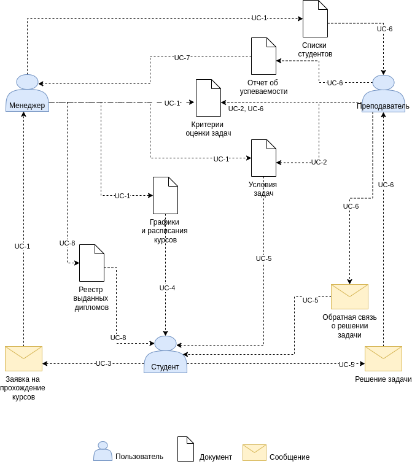

Создание площадки для проведения соревнований по спортивному программированию
=========
|          |                                                                   |
|----------|-------------------------------------------------------------------|
|Status:   | proposed
|Deciders: | dev, devops                                                       |
|Date:     | 29.05.2023                                                        |


# Кейс

Образовательная организация Alef предоставляет услуги по обучению спортивному
программированию на языках программирования **C++** и **Python 3** и регулярно 
проводит соревнования по спортивному программированию среди своих учащихся.

Учащимся выдаётся набор задач по программированию через google-doc с выдачей
индивидуально каждому прав на просмотр по email
Решением для задач является код на выбранном языке программирования. 
Задачи дифференцируются по сложности, а оценка решения производится по критериям
- количество и сложность пройденных тестов
- количество попыток решения
- время сдачи решения.

Задача содержит: 
- описание ограничений по памяти и времени выполнения
- условие задачи
- описание входных данных
- описание выходных данных
- пример входных данных
- пример выходных данных
- примечание к примеру входных и выходных данных

Учащиеся в оговорённые сроки присылают решения на рабочий email преподавателя, 
а преподаватель должен проверить работу и выслать обратным письмом результат: 
успешное выполнение или сообщение об ошибки с указанием на каких данных код 
учащегося выдал неверные результаты.

Результаты проверки публикуются в другой google-таблице, а сводная статистика по
успеваемости в третьей.

По результатам прождения курса обучения администрация организации принимает
решение об успешности прохождения обучения и награждении наиболее отличившихся.

Проверять решение задач вручную является довольно затратным процессом. Так же
много времени и сил у педагогов отнимает публикация результатов решения 
для учащихся и административных сотрудников организации. При том что это разные 
по составу отчёты: 
- Для административных сотрудников необходима информация об успеваемости
учащихся
- Для учащихся необходима информации о проверке конкрретно их решения и
примеры(тесты), на которых их решение.


Пример задачи (пример позаимствован тут https://codeforces.com/contest/1833/problem/A)

Условие задачи

> Влад решил записать мелодию на своей гитаре. Представим мелодию как 
> последовательность нот, которым соответствуют символы 'a', 'b', 'c', 'd', 'e', 
> 'f' и 'g'.
> 
> Однако, он не очень опытен в игре на гитаре и может записать ровно две ноты за 
> раз. Влад хочет получить мелодию s и для этого он может сводить записанные 
> мелодии вместе. При этом, последний звук в первой мелодии должен совпадать с 
> первым звуком второй мелодии.
> 
> Например, если Влад записал мелодии «ab» и «ba», он может свести их вместе и 
> получить мелодию «aba», а потом свести результат с «ab» и получить «abab».
> 
> Помогите Владу определить, какое минимальное количество мелодий из двух нот ему 
> нужно записать, чтобы получить мелодию s.

Описание входных данных

> В первой строке входных данных содержится целое число **t** (1 < t < 10^4) - 
> количество наборов входных данных в тесте.
> 
> Далее следуют описания наборов.
> 
> Первая строка набора содержит целое число n (2≤n≤50) — длина мелодии s.
> 
> Вторая строка набора содержит строку s из n символов, каждый из которых 
> 'a', 'b', 'c', 'd', 'e', 'f' или 'g'.

Описание выходных данных

> Выведите **t** целых чисел, каждое из которых является ответом на 
> соответствующий набор входных данных. В качестве ответа выведите 
> **минимальное**
> количество мелодий из двух нот, которое нужно записать Владу.

Пример входных данных

```
5
4
abab
7
abacaba
6
aaaaaa
7
abcdefg
5
babdd
```

Пример выходных данных

```
2
4
1
6
4
```

Примечание к примеру входных и выходных данных

> В первом примере нужно записать мелодии «ab» и «ba», как и было описано в 
> условии.
> 
> Во втором примере нужно записать мелодии «ab», «ba», «aс» и «сa».
> 
> В третьем примере единственная необходимая мелодия это «aa».

# Бизнес-цели

- Разработать систему для удалённого размещения задач по программированию,
проверки решения и автоматической публикации и рассылки результатов. 
- Увеличить  производительность труда педагогов, и позволить одновременно обучать 
больше студентов по имеющимся языковым направлениям.
- Кратно расширить целевую аудиторию среди потенциальных учащихся за счет 
привлечения большего числа педагогов и студентов на новые языковые направления.
- Обеспечить защиту персональных данных учащихся, а так же минимизировать риски,
связанные с использованием внешних ресурсов (доступа к ним третьих лиц и
доступности)
- Иметь возможность в дальнейшем дорабатывать под собственные нужды 
без сверхусилий и привлечения разработчиков редких, дефицитных и дорогих
специальностей (см. https://habr.com/ru/articles/651585/).

# Бизнес-драйверы

- Рост количества обучающихся практически остановился(упёрся) в количество
преподавателей и их физические возможности 
- Хранение персональных данных студентов на серверах третьих лиц (зачастую за
пределами РФ) несёт риски неисполнения ФЗ 152 и следующих за этим санкций со
стороны надзорных органов. 
- Большие задержки в скорости проверки задач вызывают негатив среди учащихся и
потенциально грозит оттоком студентов в конкурирующие организации
-  

# Стейкхолдеры и их потребности

Заинтересованные стороны, ключевые участники:

- Администратор - эти люди имеют дело с учетными записями пользователей и 
    биллинговой системой
- Клиент - клиент, который заплатил за услугу 
- Эксперт (сисопс) человек, который исправляет проблему на месте
- Менеджер - есть ли неудовлетворенные клиенты, есть ли заявки, которые не будут 
    назначены экспертом слишком долго, есть ли какие-либо проблемы с 
    выставлением счетов и т. д.
- Служба поддержки - это первая линия поддержки для клиентов, они обеспечивают 
    прямую поддержку по телефону от человека к человеку
- Команда разработки

# Пользовательские истории

UC-1: Пользовательское обслуживание:
- администратор ведет внутренние учетные записи пользователей (клиентов)
- администратор поддерживает экспертный набор навыков, местоположение и 
    доступность

UC-2: Регистрация клиента:
- клиенты регистрируют свой профиль, кредитную карту и план поддержки

UC-3: Воркфлоу заявки:
- клиенты создают заявки на обслуживание через Интернет
- клиенты создают заявки на обслуживание по звонку с помощью техподдержки
- эксперты используют мобильное приложение для чтения заявки и изменения статуса 
    аявки
- эксперты могут осуществлять поиск в базе знаний через мобильное приложение

UC-4: Отправка опроса удовлетворенности:
- клиенты заполняют и отправляют опросы удовлетворенности

# Атрибуты качества

- сервисы и базы знаний, ориентированные на клиентов, должны быть высокодоступными,
    поскольку перебои в работе отрицательно скажутся на бизнесе
- время отклика < 2 с при загрузке страницы
- время поиска в базе знаний несколько секунд
- формирование отчетов не должно занимать чрезмерно много времени
- не должно быть утерянных тикетов
- личная информация клиентов и кредитные карты должны храниться в безопасности и
    соответствовать требованиям PCI

# Контекстная схема системы



# Текущая архитектура


# Критические сценарии

- клиенты создают заявки на обслуживание через Интернет
- клиенты создают заявки на обслуживание по звонку с помощью техподдержки
- эксперты используют мобильное приложение для чтения заявки и изменения статуса
    заявки
- эксперты могут осуществлять поиск в базе знаний через мобильное приложение

# Критические характеристики

- доступность сервисов и базы знаний доля ошибочных ответов от сервиса и базы 
    знаний (можно ориентироваться на 99.9%)
- время ответа сервиса и базы знаний
    + 95% квантелиь времени ответа сервисов для клиента (не должно превышать 3с)
    + 95% квантиель времени ответа поиска в базе знаний (не более 5с)
- надежность: доля утерянных тикетов (не должно быть вообще)
- время разработки (time to market)
- стоимость разработки (budget/cost)

# Архитектурные решения

## Архитектурное решение 1
## Архитектурное решение 2
## Архитектурное решение 3

# Сравнение архитектурных решений

## Удовлетворение базовых сценариев

| Пользовательский сценарий                      |Решение 1|Решение 2|Решение 3|
|------------------------------------------------|---------|---------|---------|
| UC1: заголовок сценария 1                      |    0    |    +    |   ++    |
| UC2: заголовок сценария 2                      |    -    |    0    |   +     |
| UC3: заголовок сценария 3                      |    +    |    --   |    0    |

- *--* - много хуже текущего положения вещей
- *-* - хуже текущего положения вещей
- *0* - на уровне текущего положения вещей
- *+* - лучше текущего положения вещей
- *++* - намного лучше текущего положения вещей

## Удовлетворение критических сценариев

| Пользовательский сценарий                      |Решение 1|Решение 2|Решение 3|
|------------------------------------------------|---------|---------|---------|
| CC1: заголовок критического сценария 1         |    0    |    +    |   ++    |
| CC2: заголовок критического сценария 2         |    -    |    0    |   +     |
| CC3: заголовок критического сценария 3         |    +    |    --   |    0    |

- *--* - много хуже текущего положения вещей
- *-* - хуже текущего положения вещей
- *0* - на уровне текущего положения вещей
- *+* - лучше текущего положения вещей
- *++* - намного лучше текущего положения вещей

## Удовлетворение атрибутов качества

| Атрибуты качества                              |Решение 1|Решение 2|Решение 3|
|------------------------------------------------|---------|---------|---------|
| Атрибут качества 1                             |    0    |    +    |   ++    |
| Атрибут качества 2                             |    -    |    0    |   +     |
| Aтрибут качества 3                             |    +    |    --   |    0    |

- *--* - много хуже                           
- *-* - хуже                          
- *0* - на том же уровне                  
- *+* - лучше                         
- *++* - намного лучше                         

## Удовлетворение критических характеристик

| Критические характеристики                     |Решение 1|Решение 2|Решение 3|
|------------------------------------------------|---------|---------|---------|
| Критическая характеристика 1                   |    0    |    +    |   ++    |
| Критическая характеристика 2                   |    -    |    0    |   +     |
| Критическая характеристика 3                   |    +    |    --   |    0    |

- *--* - много хуже                           
- *-* - хуже                          
- *0* - на том же уровне                  
- *+* - лучше                         
- *++* - намного лучше                         


# Риски архитектурных решений

## Риски архитектурного решения 1
## Риски архитектурного решения 2
## Риски архитектурного решения 3

# Окончательное архитектурное решение
