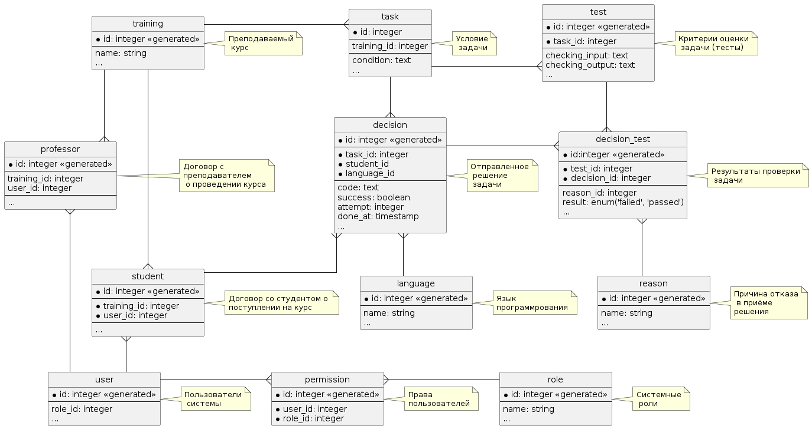

Декомпозиция выбранной архитектуры на функциональные компоненты
=========
|          |                                                                   |
|----------|-------------------------------------------------------------------|
|Status:   | proposed 
|Deciders: | dev, devops                                                       |
|Date:     | 04.07.2023                                                        |

# Кейс

Необходимо декомпозировать выбранную в рамках [ADR-0001](../ADR-0001/README.md) архитектуру на функцональные компоненты

# Модели предметной области 

## Модель "Сущность-Связь"  

## Модель состояний

### Для студента

### Для преподавателя

### Для менеджера

# Функциональная декомпозиция

## По взаимодействию с пользователями

### Аутентификация и авторизация

| Метод   | URL                         | Назначение                           |
|---------|-----------------------------|--------------------------------------| 
| POST    |/api/v1/auth/front/login     | Вход                                 |
| POST    |/api/v1/auth/front/logout    | Выход                                |
| GET     |/api/v1/auth/front/profile   | Профиль пользователя                 |
| GET     |/api/v1/auth/back/user       | Что за пользователь по по сессии     |
|         |                             |                                      |

### Сервисы менеджера

### Сервисы преподавателя

### Сервисы студента

## По сущностям системы
