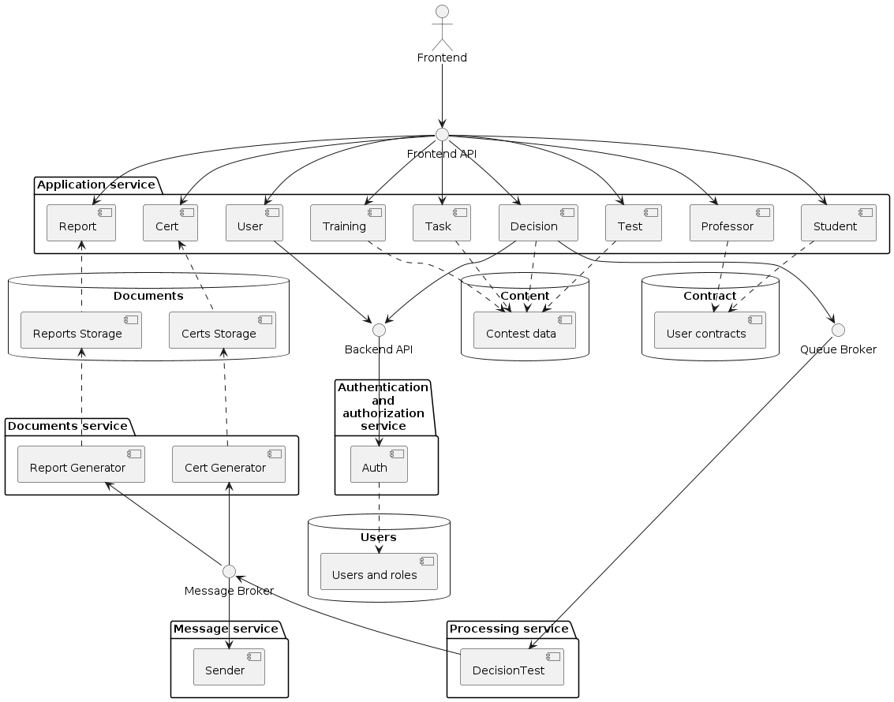

Проектрование взаимодействия сервисов и оценка решения
=========
|          |                                                                   |
|----------|-------------------------------------------------------------------|
|Status:   | proposed 
|Deciders: | dev, devops                                                       |
|Date:     | 12.07.2023                                                        |

# 1. Кейс

Необходимо описать взаимодействие нескольких сервисов на основе 
функционального зазбиения, выбранного в  [ADR-0002](../ADR-0002/README.md)
Для критичных сценариев

1. UC-5: Отправка студентом решения задачи преподавателю
2. UC-6: Проверка преподавателем решения студента и предоставление обратной связи

# 1. Диаграмма компонентов 

# 2. Диаграммы последовательностей для сценариев

## 2.1 Аутентификация пользователя

## 2.2 Отправка студентом решения задачи преподавателю

## 2.3 Проверка решения студента и предоставление обратной связи

# 3. Оценка атрибутов качества

Оценивать взаимодействие сервисов будем согласно 
[атрибутам качества](../ADR-0001/README.md#атрибуты-качества) и 
[критическим характеристиками](../ADR-0001/README.md#критические-характеристики)
, описанными в [ADR-0001](../ADR-0001/README.md), которые касаются выбранных
критических сценариев.

- UC-5: Отправка студентом решения задачи преподавателю
- UC-6: Проверка преподавателем решения студента и предоставление обратной связи

## 3.1 Атрибуты качества

### 3.1.1 Обратная связь от преподавателя студенту по предоставленному решению задачи должна даваться как можно быстрее

За счет увеличения числа консьюмеров компонента "Decision test" 
(см [2.3](#23-проверка-решения-студента-и-предоставление-обратной-связи)) можно 
горизонтально масштабировать проверку решений в широких пределах, обеспечив 
удовлетворительное время обратной связи при проверке задачи.

Отрицательной стороной такого подхода является необходимость проработки вопросов
безопасности и изоляции консьюмеров как друг от друга так и от системы в целом,
что может сказаться на высоком потреблении ресурсов таким набором консьюмеров и
 необходимости гибко скалировать изменять их количество. Уменьшать в затишье и
 увеличивать при наплывах.

### 3.1.2 Доступность отчета об успеваемости должна быть высокой 

Поскольку отчет подготавливается по подписке из брокера сообщений, его можно
не генерировать из БД на лету, а предоставлять некий актуальный на данный момент
документ, генерируемый из БД по мере прхода решений от студентов. 
Вплоть до того, что сохрвнять в виде статичного json или xml документа,
с отдачей простым web-сервером.

Отрицательной стороной такого подхода является временная неконсистентность 
данных, особенно при высокой интенсивности подачи решений. Последние решения
будут "застревать" в очереди на проверку и отчет не будет отображать текущего 
реального положения вещей. Ещё на консистентности плохо скажется правка данных в
БД с решениями в обход механизма сообщений. 

## 3.2 Критические характеристики

### 3.2.1 Время реакции на решение. 

*Время ответа при отправке (от отправки до информации о том было ли решение 
принято или произошел отказ) не должно превышать 5 секунд для решения объёмом 
до 100 кБайт исходного кода при канале связи со студентом не хуже 1 МБит.*

Решение при текушей нагрузке, а так же увеличению её на порядок способно
выдержать заданные характеристки. Так же оно имеет потенциал для масштабирования.

За счёт того, что решение пишется в БД в "сыром виде", а его проверка ставится в
очередь, реакция на отправку решения зависит большей частью от 
(см. [диаграмму 2.2](#22-отправка-студентом-решения-задачи-преподавателю)):
- времени проверки прав пользователя - этот компонент работает на чтение  может 
быть отмасштабирован как за счёт репликации так и шардирования базы данных 
пользователей
- времени записи решения в базу данных решений - тут для уменьшения времени 
отклика между запросом на добавление задания от пользователя и записью в БД 
можно организовать очередь.

### 3.2.2 Отказы принятия решений. 

*Количество отказов при приёме задач на проверку не должно превышать 0.1% в 
месяц*

Надёжность определяется в основном надёжностью работающих в составе системы
СУБД. Кроме того, метод добавления решения задачи 
(см [ADR-0002 п.3.2.7](../ADR-0002#327-решение-задачи)) подразумевает 
передачу ключа идемпотентности (uuid) что должно при сбое добавления решения 
предотвратить ситуацию, когда одно и то же решение добавляется несколько раз 
и портит статистику успеваемости.

### 3.2.3 Время проверки задачи. 

*Время проверки одной задачи от приёма решения до отправки обратной связи о 
решении не должно превышать 5 минут.*

Время проверки одной задачи зависит от лимитов выделяемых на один тест задачи и 
количества подаваемых решений одновременно. Масштабированием числа консьюмеров 
компонента "Decision test" можно добиться выдерживания данной харарактеристики 
для большого числа пользователей.

Однако это всё будет стоить ресурсов и в некоторых случаях имеет смысл пойти на
компромисс, смягчив в разумных пределах это требование.

### 3.2.4 Ни одно решение и ни один результат проверки решения не должен быть потерян.

Информация, находящаяся в очередях и брокерах сообщений дублируется в базы 
данных и при сбоях и спорных ситуациях может быть оотуда извлечена и 
использована для восстановления консистентности (например между БД отчетов и 
БД решений).

Однако процесс восстановления консистентности может быть довольно непростым и 
содержать запросы к почти всем БД системы и/или почти ко всем сервисам.
