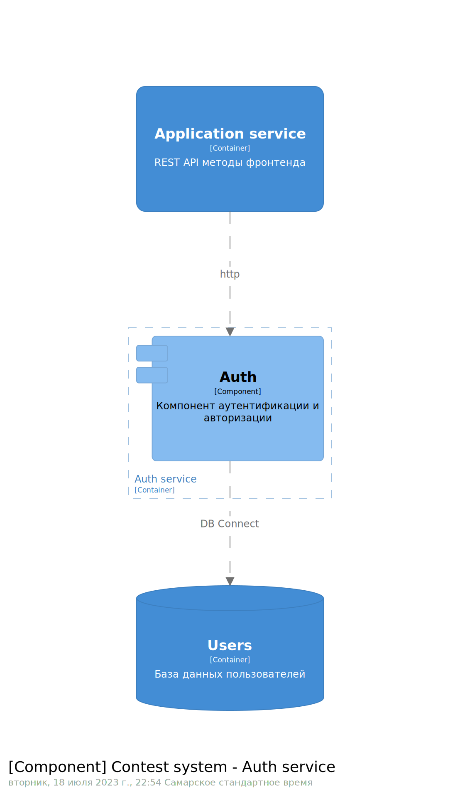
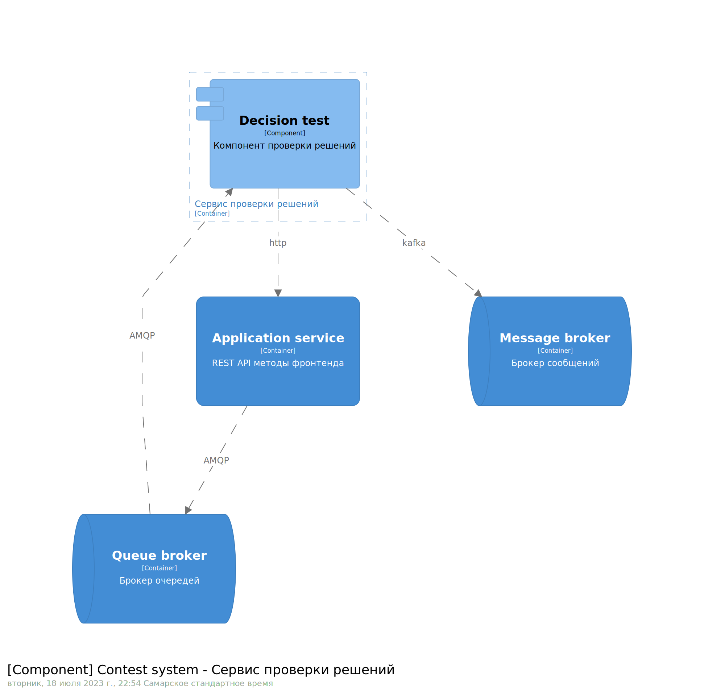
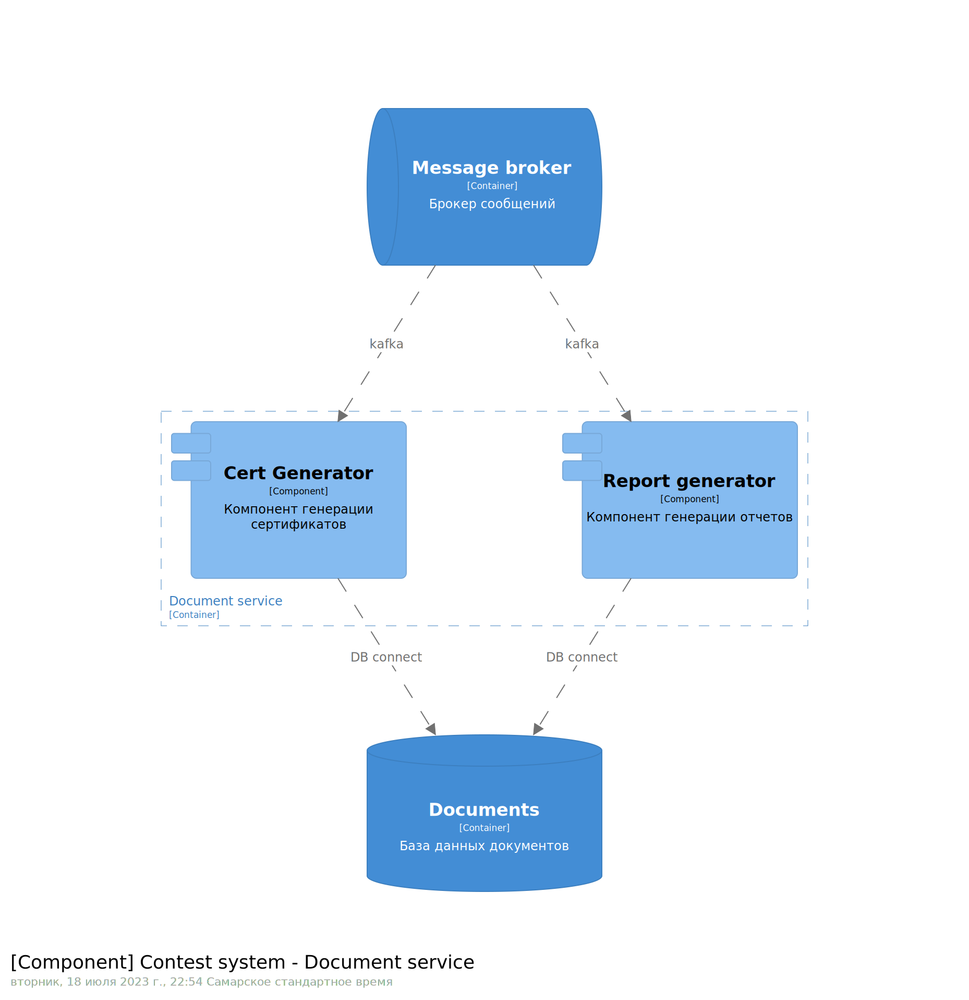
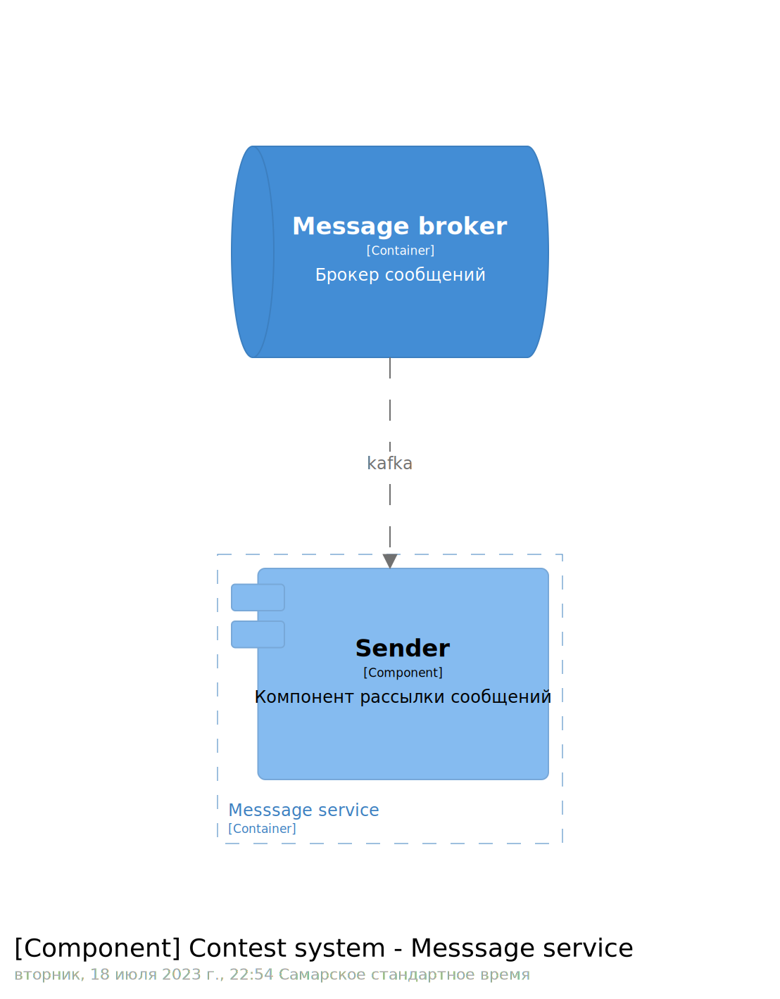
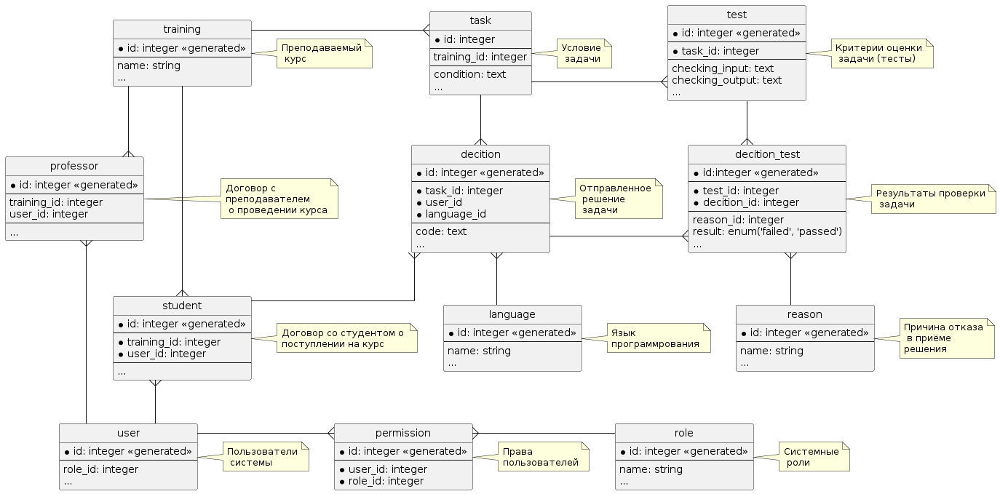
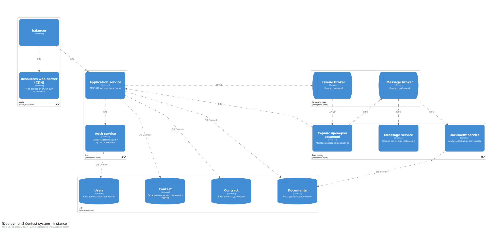

Системное проектирование
=========
|          |                                                                   |
|----------|-------------------------------------------------------------------|
|Status:   | proposed 
|Deciders: | dev, devops                                                       |
|Date:     | 17.07.2023                                                        |

# 1. Кейс

Для ранее принятых решений ARD-0001:ADR-0003
- Изобразить диаграмму контейнеров приложения на основе выбранной модели 
функциональной декомпозиции (см. [ADR-0002](../ADR-0002/README.md))
- Декомпозировать слой данных: какие данные в каких БД хранятся. На основе 
описания взаимодействия в [ADR-0003](../ADR-0003/README.md)
- Изобразить деплоймент-диаграмму

# 2. Контейнеры приложения

## 2.1 Контекст системы

Все заинтересованые пользователи работают с системой через web-приложение

## 2.2 Контейнеры системы

Контейнеры системы можно условно поделить на
- Сетевого взаимодействия с пользователем
    + Balancer
    + Resources web-server (CDN)
- Обслуживания API-запросов
    + Application service
    + Auth service
- Обработки фоновых заданий и очередей
    + Queue broker
    + Processing service (Сервис проверки решений)
    + Message broker
    + Document service
    + Message service
- Хранения данных
    + Contest (база данных с задачами, решениями и тестами)
    + Contract (база данных с договорами и перс.данными пользователей)
    + Users (база данных с пользователями и их сессиям)
    + Documents (база данных документов - отчеты и сертификаты)

## 2.3 Контейнеры обслуживания API запросов

Состоят из компонентов, реализующих функциональные блоки API, деление на 
которые было принято в [ADR-0002](../ADR-0002/). Компоненты работают либо с БД
непосредственно, либо передают задания в брокер очередей для последующей 
обработки контейнерами группы "обработки фоновых заданий".

Связь с контейнером **Auth service** обеспечивает разганичение прав на 
выполнение методов публичного API

## 2.4 Обработка фоновых заданий

Компонент проверки решений получает задания из брокера очередей, а результат
выполенения помещает в брокер сообщений. Состояние баз данных он изменяет не
непосредственно, а через API Application service 

Получив сообщения из брокера сообщений компоненты генерации отчетов и 
сертификатов создают необходимые документы и кладут их в БД.

Одним из читателей является компонент рассылки уведомлений пользователям о 
завершении проверки

# 3. Слой данных

Взаимоотношения между хранимыми сущностями изображено на ER-диаграмме в 

Целесообразно разбить её на следующие изолированные БД

## 3.1 User

Сущности:
- user
- permission
- role

Благодаря выделению этой БД мы можем в будущем расширять функционал авторизации 
и аутентификации и масштабироваться при увеличении аудитории. Часть её 
(например сессии пользователей вообще может храниться в памяти).

## 3.2 Contract

Сущности:
- student
- professor

Эта БД содержит наиболее чувствительную к соблюдению закона о защите персданных 
и может быть размещено на оборудовании, сертифицированном для этих целей

## 3.3 Contests

Сущности:
- task
- test
- decision
- training
- decision test 
- language
- reason

Эта БД содержит информацию о составе курсов, задачах, тестах, решениях. С этими 
БД работает в основном сервис публичных API запросов.

## 3.4. Documents

Её сущности не отражены в ER-диаграмме. Это документы: отчеты, сертификаты и пр.
что генерируются как результат деятельности системы. Такая БД не обязана быть 
реляционной и может быть просто файловым хранилищем с соостветствующими 
способами обработки (например индексации) или доступа (не только через API-мето
ды, но и по SFTP или с резерфированием на Яндекс-диск)

# Deployment-диаграмма

На данном жизненном этапе продукта каджый из контейнеров представлен одним или
двумя экземплярами. При этом они сгруппированы на серверах по функциональному
назначению. 

Однако все контейнеры кроме содержащих слой данных являются stateless и при 
желании могут быть помещены на разные серверы или в kubernetes кластер.

К масштабированию stateful контейнеров с данными стоит подойти индивидуально в 
зависимости от выбранных технологий. К какием-то применить реплицирование, а 
для каких-то использовать возможности кластеризации.
